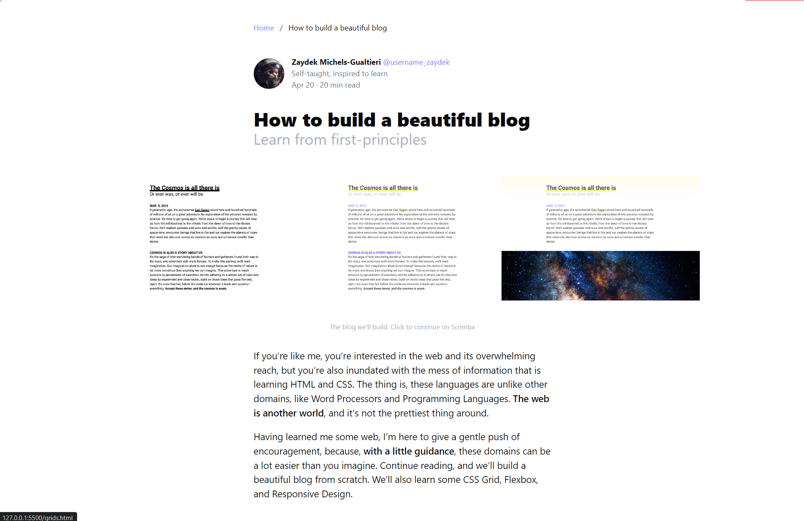
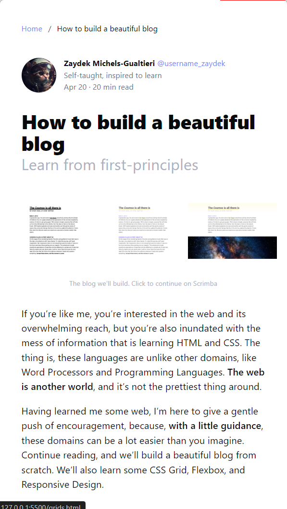

# Blog Design using Bulma

This project demonstrates a simple and beautiful blog design using the Bulma CSS framework. The design showcases a clean and modern interface, making use of various Bulma components such as sections, columns, media objects, and more.

## Table of Contents

- [Features](#features)
- [Installation](#installation)
- [Usage](#usage)
- [Customization](#customization)
- [Technologies Used](#technologies-used)

## Features

- Clean and responsive layout.
- Utilizes Bulma CSS framework for styling.
- Includes a breadcrumb navigation for better user experience.
- Media object to display author information.
- Image grid showcasing blog-related content.
- Responsive design with CSS Grid and Flexbox.

## Installation

To get a local copy up and running, follow these simple steps:

1. Clone the repository:
   ```bash
   git clone https://github.com/yourusername/blog-design-bulma.git
   ```
2. Navigate to the project directory:
   ```bash
   cd blog-design-bulma
   ```
3. Open the `index.html` file in your preferred web browser.

## Usage

This project is designed as a simple, static HTML page. To use it:

- Simply edit the content within the `index.html` file to suit your needs.
- Customize the images by replacing the image sources in the `` tags.
- Update the author details and other text content as required.

## Customization

You can easily customize the following aspects of the blog design:

- **Color Scheme**: Modify the color classes in the HTML or create a custom CSS file to override the Bulma defaults.
- **Typography**: Adjust the font sizes and weights by modifying Bulma's classes or creating custom styles.
- **Images**: Replace the image URLs in the `` tags to use your own images.

### Example Customization

To change the primary color used in the blog design:

1. Create a new CSS file, e.g., `custom.css`.
2. Include this file in your `index.html`:
   ```html
   <link rel="stylesheet" href="custom.css" />
   ```
3. Override Bulma's default primary color in `custom.css`:
   ```css
   .has-text-black {
     color: #your-new-color;
   }
   ```

## Technologies Used

- **HTML5**: Markup language used to structure the content.
- **Bulma**: A modern CSS framework based on Flexbox.
- **Font Awesome**: Icon toolkit used for adding icons to the design.

> Desktop Screens : 



> Mobile Screens : 

